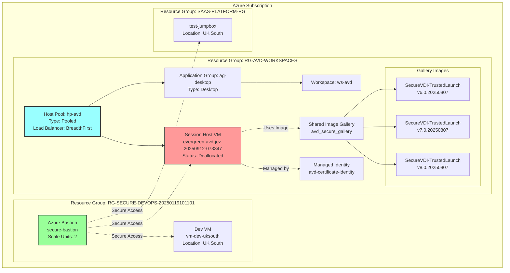
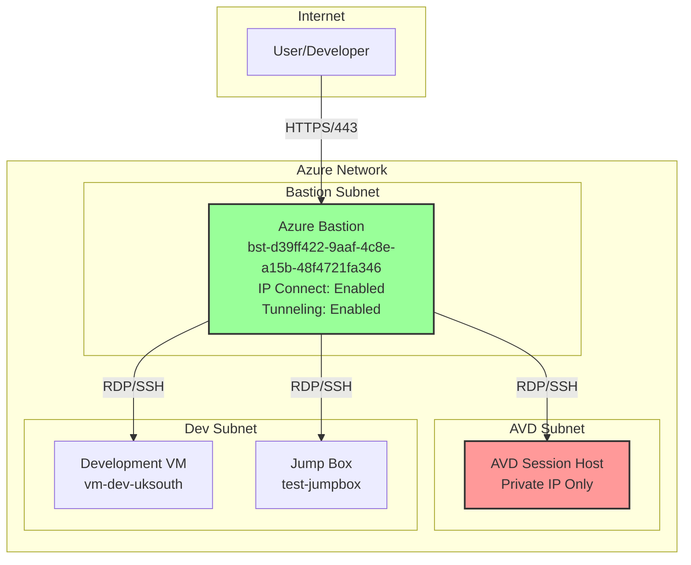

# Azure Virtual Desktop (AVD) Development Environment

## Current State Overview
**Date:** 2025-09-22  
**Azure Subscription:** Microsoft Azure Sponsorship  
**VM Status:** Deallocated (Stopped)

## Infrastructure Architecture



## AVD Build Process Flow

```mermaid
flowchart LR
    subgraph "AVD Infrastructure Build"
        Start[Start] --> CheckRG{Resource Group<br/>Exists?}
        CheckRG -->|No| CreateRG[Create RG-AVD-WORKSPACES]
        CheckRG -->|Yes| CheckGallery{Gallery<br/>Exists?}
        CreateRG --> CheckGallery
        
        CheckGallery -->|No| CreateGallery[Create Shared<br/>Image Gallery]
        CheckGallery -->|Yes| CheckImages{Images<br/>Available?}
        CreateGallery --> UploadImages[Upload/Create<br/>Gallery Images]
        UploadImages --> CheckImages
        
        CheckImages -->|Yes| CreateHP[Create Host Pool<br/>hp-avd]
        CreateHP --> ConfigHP[Configure:<br/>- Pooled Type<br/>- BreadthFirst LB<br/>- Max Sessions: 10]
        
        ConfigHP --> CreateAG[Create Application<br/>Group]
        CreateAG --> CreateWS[Create Workspace]
        CreateWS --> LinkAGWS[Link AG to<br/>Workspace]
        
        LinkAGWS --> CreateVM[Create Session<br/>Host VM]
        CreateVM --> ConfigVM[Configure VM:<br/>- Standard_B2s<br/>- Linux OS<br/>- East US]
        
        ConfigVM --> JoinHP[Join VM to<br/>Host Pool]
        JoinHP --> InstallAgent[Install AVD<br/>Agent]
        
        InstallAgent --> ConfigRDP[Configure RDP:<br/>- Clipboard: Disabled<br/>- Printers: Disabled<br/>- Audio: Disabled<br/>- USB Redirect: Enabled]
        
        ConfigRDP --> CreateIdentity[Create Managed<br/>Identity]
        CreateIdentity --> AssignRoles[Assign RBAC<br/>Roles]
        
        AssignRoles --> ConfigBastion[Configure Bastion<br/>Access]
        ConfigBastion --> Complete[AVD Ready]
    end
    
    style Start fill:#9f9
    style Complete fill:#f9f
```



## VM Configuration

### Session Host Details
- **Name:** evergreen-avd-jez-20250912-073347
- **Size:** Standard_B2s (2 vCPUs, 4 GB RAM)
- **OS:** Linux
- **Location:** East US
- **Current State:** Deallocated (VM stopped to save costs)

### Host Pool Configuration
- **Name:** hp-avd
- **Type:** Pooled (multiple users can share VMs)
- **Load Balancer:** BreadthFirst (fill first VM before using next)
- **Max Sessions:** 10 users per VM
- **Start VM on Connect:** Disabled
- **Validation Environment:** False (Production)

### Custom RDP Properties
```
drivestoredirect:s:;
usbdevicestoredirect:s:;
redirectclipboard:i:0;        # Clipboard disabled
redirectprinters:i:0;          # Printers disabled
audiomode:i:0;                 # Audio disabled
videoplaybackmode:i:1;         # Video playback enabled
devicestoredirect:s:*;         # All devices redirect
redirectcomports:i:1;          # COM ports enabled
redirectsmartcards:i:1;        # Smart cards enabled
enablecredsspsupport:i:1;      # CredSSP enabled
redirectwebauthn:i:1;          # WebAuthn enabled
use multimon:i:1;              # Multi-monitor enabled
```

## Network Architecture



## Image Gallery

### Shared Image Gallery: avd_secure_gallery
**Location:** UK South

**Available Images:**
1. **SecureVDI-TrustedLaunch v6.0.20250807**
2. **SecureVDI-TrustedLaunch v7.0.20250807**
3. **SecureVDI-TrustedLaunch v8.0.20250807**

All images are configured with Trusted Launch for enhanced security.

## Access Methods

### 1. Azure Bastion Access
- **Bastion Host:** secure-bastion
- **DNS:** bst-d39ff422-9aaf-4c8e-a15b-48f4721fa346.bastion.azure.com
- **Features:**
  - IP Connect: Enabled
  - Tunneling: Enabled
  - File Copy: Disabled
  - Copy/Paste: Disabled
  - Scale Units: 2

### 2. AVD Client Access
- Connect via AVD client application
- Workspace: ws-avd
- Application Group: ag-desktop

## Security Configuration

### Managed Identity
- **Name:** avd-certificate-identity
- **Location:** UK South
- **Purpose:** Certificate management and authentication

### Security Features
- Trusted Launch VMs
- Managed Identity for authentication
- Bastion for secure access (no public IPs)
- Disabled clipboard and printer redirection
- WebAuthn support for passwordless auth

## Current Issues & Status

### VM State
- **Current Status:** Deallocated (Stopped)
- **Action Required:** Start VM before connecting
- **Command to Start:**
  ```bash
  az vm start -n evergreen-avd-jez-20250912-073347 -g RG-AVD-WORKSPACES
  ```

### Cost Optimization
- VM is currently deallocated to save costs
- Standard_B2s is a burstable instance type
- Consider enabling "Start VM on Connect" for automatic startup

## Management Commands

### Start AVD VM
```bash
az vm start -n evergreen-avd-jez-20250912-073347 -g RG-AVD-WORKSPACES
```

### Stop AVD VM
```bash
az vm deallocate -n evergreen-avd-jez-20250912-073347 -g RG-AVD-WORKSPACES
```

### Check VM Status
```bash
az vm get-instance-view -n evergreen-avd-jez-20250912-073347 -g RG-AVD-WORKSPACES --query 'instanceView.statuses[].displayStatus' -o tsv
```

### Connect via Bastion
```bash
az network bastion ssh -n secure-bastion -g rg-secure-devops-20250119101101 --target-resource-id /subscriptions/80265df9-bba2-4ad2-88af-e002fd2ca230/resourceGroups/RG-AVD-WORKSPACES/providers/Microsoft.Compute/virtualMachines/evergreen-avd-jez-20250912-073347 --auth-type ssh-key --ssh-key ~/.ssh/id_rsa --username azureuser
```

## Next Steps

1. **Start the VM** if you need to access the AVD environment
2. **Configure user assignments** in the Application Group
3. **Install applications** on the session host
4. **Configure FSLogix** for user profile management (if needed)
5. **Set up monitoring** with Azure Monitor/Log Analytics